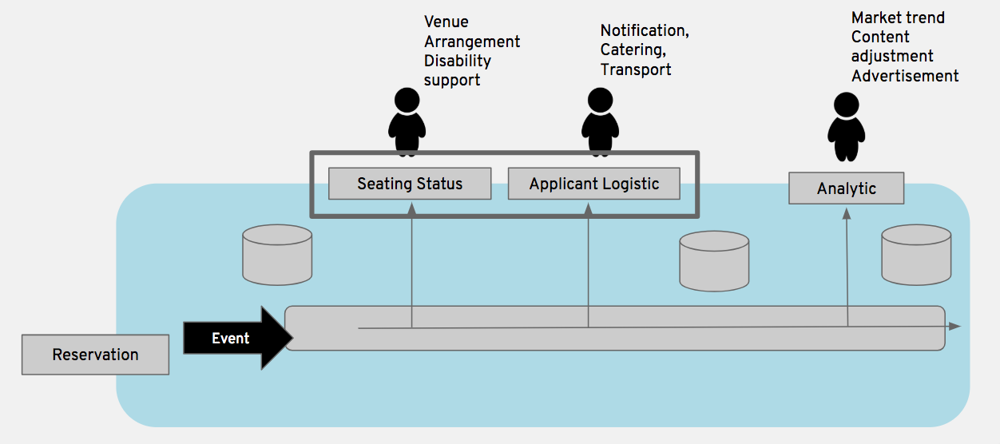
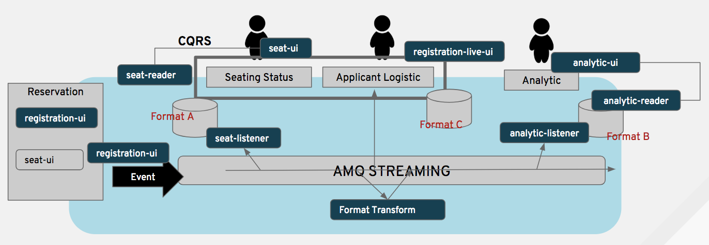
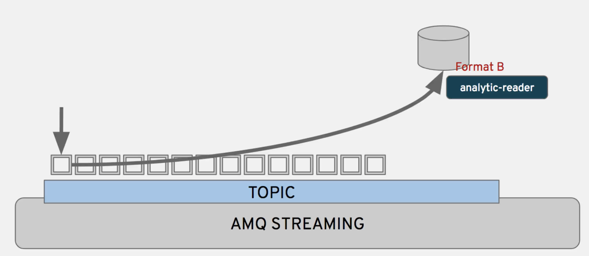
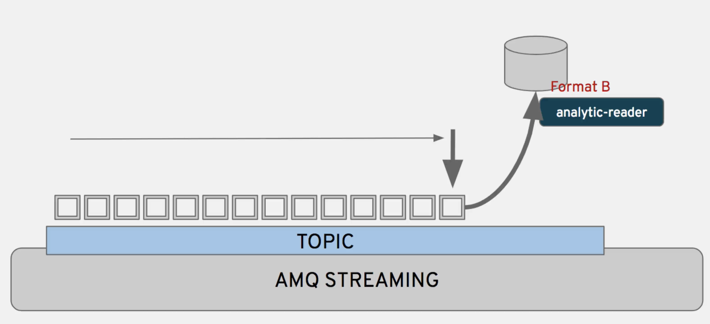

= Seat Reservation - Event Ticket Demo

This is a demo application about a seat registration. 
The objective of this demo is demonstrate how AMQ Streams (Kafka) could be used as an event stream.

Technologies used

* AMQ Streams (Kafka)
* Fuse (Camel)
* NodeJS with Patternfly for UIs

If some problem occur with the event-reader (cached data), 
you could just restart the topic offset.

## Demo setup

Just use the setup script with your Openshift HOST url.

    sh support/setup.sh apps.ramalho.openshiftworkshop.com 

## Useful informations

Restart the offset

    oc rsh kafka-0
    ./kafka-consumer-groups.sh --bootstrap-server kafka:9092 --group analyticgrouop --reset-offsets --to-earliest --all-topics --execute

